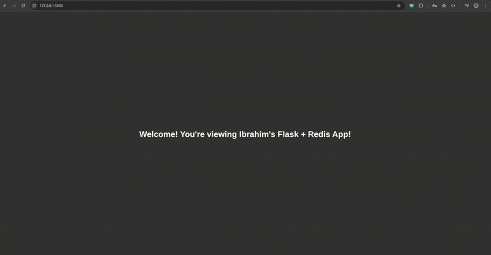

# Flask + Redis Docker App
This is a simple multi-container application built with **Flask** and **Redis**, fully dockerized. Page visits are counted are stored using the Redis database connected with the Flask service.

- **What it does:**
    - `/` -> Displays a welcome message.
    - `/count` -> Displays the number of visits using Redis as a key-value store.

---

## Demo


---

## Features
- Simple visit counter using Redis
- Multi-container setup with Docker Compose
- Fully containerised, can run anywhere Docker is installed

## Stack
- **Python 3.8 + Flask**
- **Redis**
- **Docker / Docker Compose**

---

## Project Structure
```
my-flask-redis-docker-app/
│
├── app.py           # Flask app, defines routes and Redis logic
├── requirements.txt # Python dependencies
├── Dockerfile       # Defines Flask container setup
├── docker-compose.yml # Defines multi-container setup with Flask + Redis
└── README.md 
```

---

## Setup Instructions

### 1. Clone the repo:
```
git clone <repo-url>
cd my-flask-redis-docker-app
```

### 2. Build and run the containers:
```
docker compose up --build
```

### 3. Access the app:
- **Open your web browser:**
    - Welcome page -> `http://localhost:5000`
    - Count page -> `http://localhost:5000/count`

### 4. Stop the app:
```
docker compose down
```

---

## Environment Variables

To make the app more production-ready in other environments without changing the code, we use environment variables.

In the `docker-compose.yml` file:
```
environment:
    - REDIS_HOST=redis
    - REDIS_PORT=6379
```

The Flask app reads these in `app.py`:
```
import os
from redis import Redis

redis_host = os.getenv('REDIS_HOST', 'redis')
redis_port = int(os.getenv('REDIS_PORT', 6379))
redis = Redis(host=redis_host, port=redis_port)
```

---

## Challenges faced:
- **Issue:** Initially tried using a multi-stage Dockerfile to keep images lean, but ran into `COPY --from=build` issues that caused Flask not to find the files.
- **Solution:** Fixed the copy order which fixed the problem, but reverted back to a single-stage Dockerfile since the project is small and the extra complexity was not needed.

---
